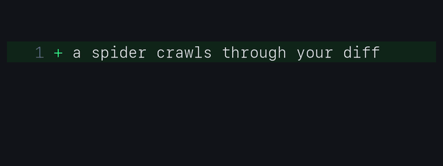
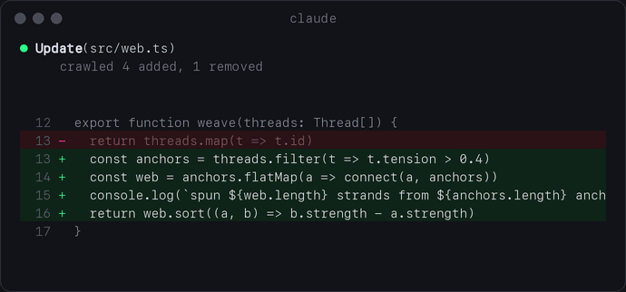
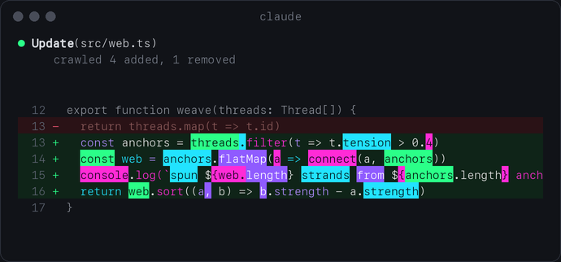

<p align="center">
  
</p>

<h1 align="center">diffspider</h1>

<p align="center">
  A tiny spider crawls over every diff Claude Code writes and marks the changed words.
</p>

<p align="center">
  
  
  
  
</p>

## What it does

Whenever Claude runs `Edit` or `Write`, diffspider replaces the plain diff with its own view.
A braille spider walks in from the left, steps from word to word on the added lines, and every
word a foot lands on lights up. When it is done it leaves to the right and the marks stay.

<p align="center">
  
</p>

After the crawl:

<p align="center">
  
</p>

## Install

Type this at the Claude Code prompt:

```
/plugin install diffspider --marketplace Silvertree2010/diffspider
```

Answer `y` to add the marketplace and press Enter to install it for your user. It is active right away, no restart needed.

## Good to know

- Terminal only. Other surfaces (desktop, VS Code) keep the normal diff.
- Collapsed tool groups unfold while a spider is crawling and fold back when it is done.
- Diffs show up to 250 lines.
- Edits from earlier turns skip the animation and show the final marks.
- Built on the Claude Code function hooks API, which is still in early access and may change between releases.

## How it works

| File | Job |
| --- | --- |
| `hooks/diff.ts` | turns the tool result into numbered diff lines |
| `hooks/grid.ts` | lays out the text cells and picks the words to visit |
| `hooks/spider.ts` | body path, gait and steps |
| `hooks/paint.ts` | two-bone IK legs and braille body, packed into a `Raster` |
| `hooks/register.tsx` | the hooks: `tool.call`, `ui.render` for `ToolUse` and `ToolGroup` |

Each leg has a resting spot next to the body. A foot stays planted until it drifts too far from that spot, then it steps ahead. The legs move in two alternating groups, so four feet are always on the ground.

## Develop

```
claude --plugin-dir ./diffspider
claude plugin validate ./diffspider
claude plugin test ./diffspider
```

## License

[MIT](LICENSE)
